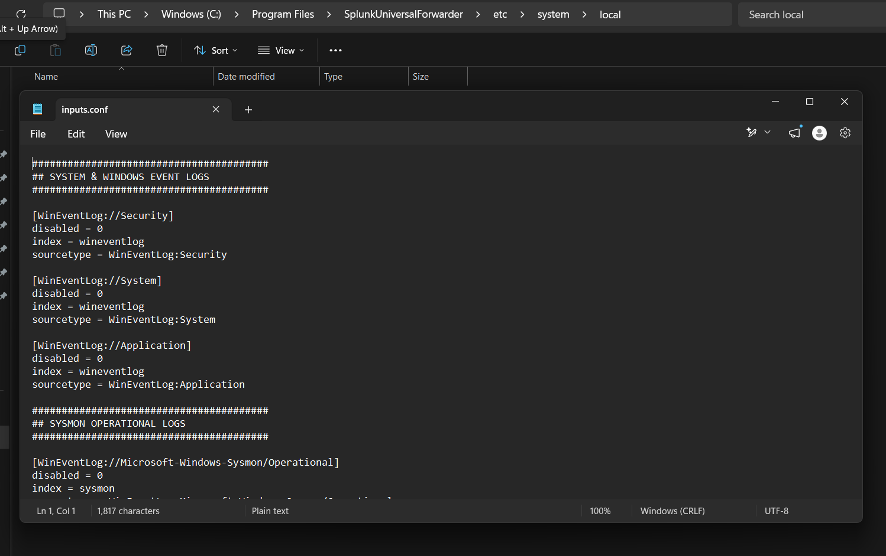
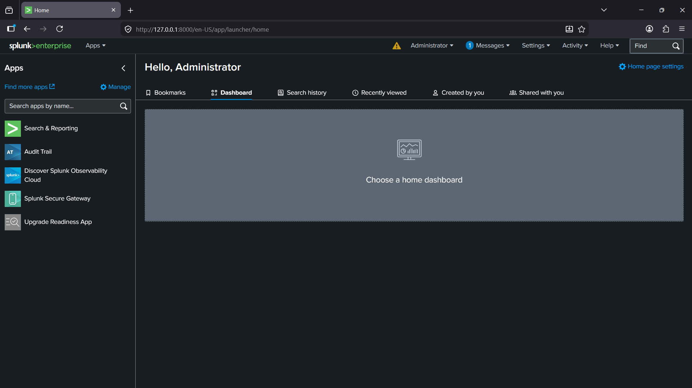
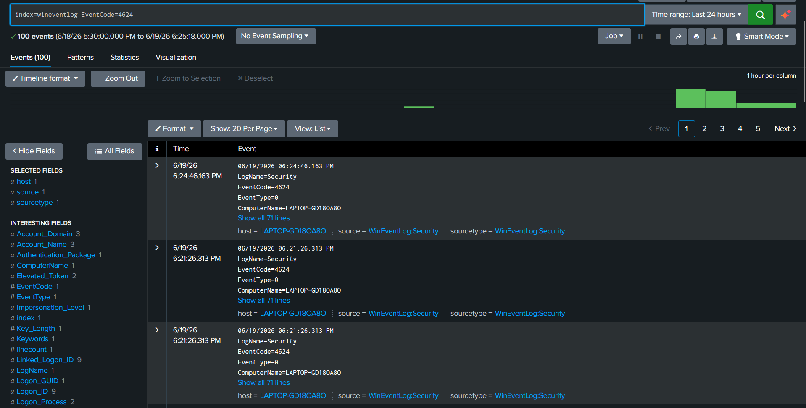
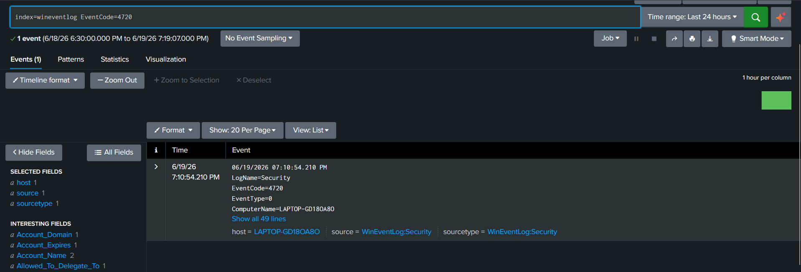
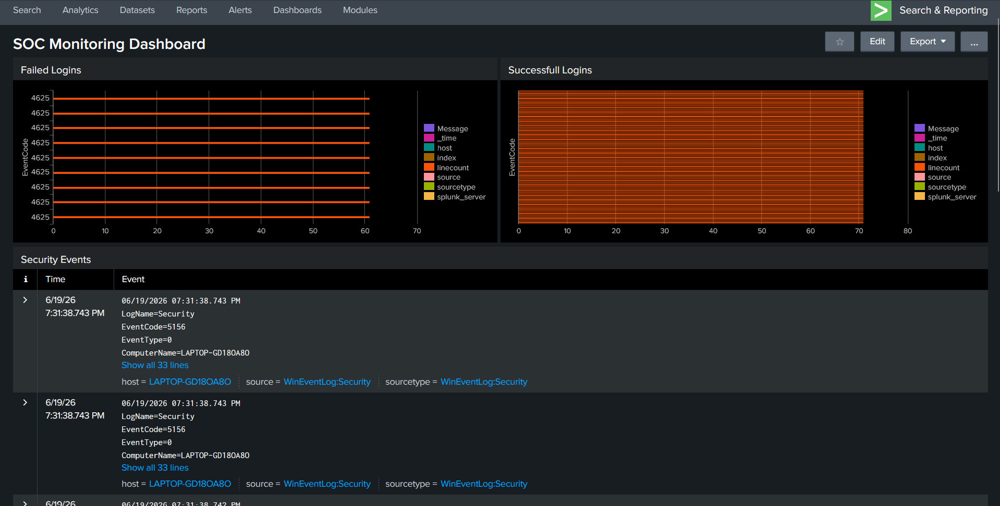
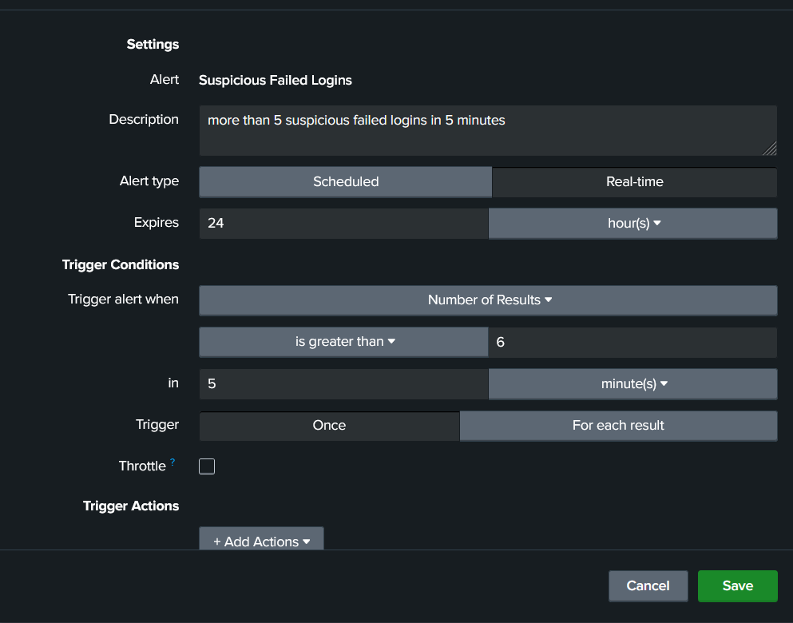
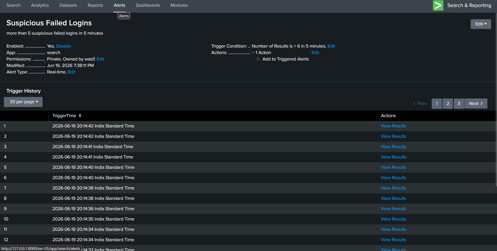
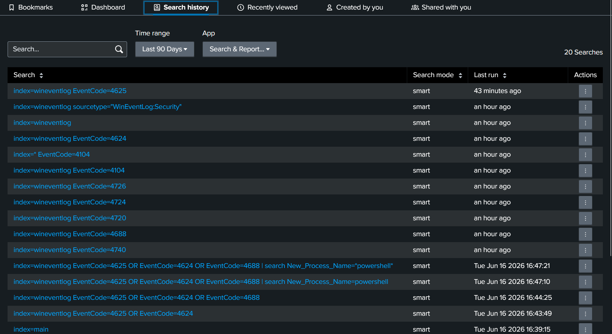

# Splunk SOC Home Lab

## Project Overview

This project demonstrates a Security Operations Center (SOC) home lab using Splunk Enterprise and Splunk Universal Forwarder.

The goal was to collect Windows Event Logs and send them to Splunk for monitoring and analysis.

## Technologies Used

- Splunk Enterprise
- Splunk Universal Forwarder
- Microsoft Sysmon
- Windows Event Logs
- Windows 11
- SPL (Search Processing Language)

---

## Architecture

Windows Endpoint ---> Splunk Universal Forwarder ---> Port 9997 ---> Splunk Enterprise ---> Search and Monitoring

### Architecture Diagram


---

## Configuration

The following configuration files were used to enable Windows Event Log collection and forwarding to Splunk Enterprise.

### inputs.conf

Location:

```text
configuration/inputs.conf
```

Purpose:

- Collect Windows Security Logs
- Collect Windows System Logs
- Collect Windows Application Logs
- Forward collected events to Splunk Enterprise

### outputs.conf

Purpose:

- Configure the Universal Forwarder to send logs to the Splunk receiving port (9997)
- Establish communication between the endpoint and Splunk Enterprise

### Configuration Screenshot




---

## Installation Steps

### Step 1: Install Splunk Enterprise

1. Download Splunk Enterprise
2. Run installer
3. Create admin account
4. Access Splunk at:

http://localhost:8000 or http://127.0.0.1:8000

### Step 2: Install Universal Forwarder

1. Download Universal Forwarder
2. Install on Windows machine

### Step 3: Enable Receiving Port on Splunk

Settings → Forwarding and Receiving

Add receiving port:

9997

### Step 4: Add Forward Server

Command:

```cmd
splunk add forward-server <Splunk_Server_IP>:9997
```

Example:

```cmd
splunk add forward-server 127.0.0.1:9997
```

### Step 5: Configure inputs.conf

1. Open Notepad as Administrator.
2. Configure like below:

```ini
[WinEventLog://Security]
disabled = 0
index = wineventlog
sourcetype = WinEventLog:Security

[WinEventLog://System]
disabled = 0
index = wineventlog
sourcetype = WinEventLog:System

[WinEventLog://Application]
disabled = 0
index = wineventlog
sourcetype = WinEventLog:Application
```

3. Save the file as `inputs.conf` in:

```text
C:\Program Files\SplunkUniversalForwarder\etc\system\local\
```

4. Select **Save as type: All Files (*.*)** and save.

### Step 6: Create a New Index

Before receiving Windows Event Logs, create a dedicated index in Splunk.

Navigate to:

Splunk → Settings → Indexes → New Index

Index Name:

```text
wineventlog (Same name as in the inputs.conf file)
```

Save the configuration.

This index is used to store Windows Event Logs forwarded from the Universal Forwarder.

### Step 7: Restart Forwarder

```cmd
splunk restart
```

### Step 8: Verify Logs

Search:

```spl
index=wineventlog sourcetype="WinEventLog:Security"
```

Expected Events:

- Event ID 4624
- Event ID 4625
- Event ID 4688
- Event ID 4720

---

## Sysmon Integration

To enhance endpoint visibility and improve threat detection capabilities, Microsoft Sysmon was deployed and integrated with Splunk.

### Sysmon Installation

1. Downloaded Sysmon and the Sysmon configuration file.
2. Extracted both files into:

```text
C:\Sysmon
```

3. Installed Sysmon using the configuration file:

```cmd
sysmon64.exe -accepteula -i sysmonconfig-export.xml
```

### Splunk Forwarder Configuration

To ensure Windows and Sysmon event logs were collected successfully, the Splunk Universal Forwarder service was configured to run using the **Local System Account**.

### Splunk Index Configuration

A dedicated index was created for Sysmon events.

Index Name:

```text
sysmon
```

### Verify Sysmon Events

Run the following SPL query:

```spl
index=sysmon
```

Expected Results:

- Process Creation Events
- Network Connection Events
- File Creation Events
- Registry Modification Events
- Image Load Events

The successful ingestion of Sysmon logs provides enhanced endpoint telemetry for security monitoring and threat hunting.

---

## Screenshots

### Splunk Home


### Windows Security Logs


### Sysmon Events

Sysmon events successfully collected and indexed in Splunk.

SPL Query:

```spl
index=sysmon
```


### Failed Login Detection


### Successful Login Detection


### New Process Created


### User Account Created


### User Account Deleted


### SOC Dashboard


### Alert Configuration


### Triggered Alert


### SPL Queries


---

## Detection Use Cases

### Sysmon Event Monitoring

SPL Query:

```spl
index=sysmon
```

Purpose:

Monitor endpoint telemetry collected by Microsoft Sysmon, including process creation, network connections, registry modifications, image loads, and other security-relevant system activity.

### Failed Login Detection

SPL Query:

```spl
index=wineventlog EventCode=4625
```

Purpose:

Detect failed Windows login attempts that may indicate brute-force activity or unauthorized access attempts.

### Successful Login Detection

SPL Query:

```spl
index=wineventlog EventCode=4624
```

Purpose:

Monitor successful user authentication activity and verify legitimate access.

### Process Creation Monitoring

SPL Query:

```spl
index=wineventlog EventCode=4688
```

Purpose:

Monitor newly created processes and identify potentially suspicious execution activity.

### User Account Creation Detection

SPL Query:

```spl
index=wineventlog EventCode=4720
```

Purpose:

Detect the creation of new local user accounts.

### User Account Deletion Detection

SPL Query:

```spl
index=wineventlog EventCode=4726
```

Purpose:

Detect the deletion of local user accounts.

---

## Dashboard and Alerting

A custom SOC monitoring dashboard was created in Splunk to provide centralized visibility into Windows security events and endpoint activity.

Dashboard panels include:

- Failed Login Attempts
- Successful Login Activity
- Windows Security Events
- Event Volume Monitoring
- User Account Activity

Alerts were configured to notify on:

- Multiple Failed Login Attempts
- Suspicious User Activity
- Security Event Monitoring

---

## Skills Demonstrated

- Security Information and Event Management (SIEM)
- Splunk Enterprise Administration
- Splunk Universal Forwarder Deployment and Configuration
- Microsoft Sysmon Deployment and Integration
- Windows Event Log Collection and Analysis
- Endpoint Telemetry Collection
- Log Analysis and Investigation
- Security Event Correlation
- Security Monitoring
- Threat Detection and Hunting
- Incident Detection and Analysis
- Dashboard Design and Visualization
- Security Alert Configuration
- SPL (Search Processing Language)
- Windows Security Event Monitoring
- Windows Process Creation Monitoring
- User Account Activity Monitoring
- Detection Engineering Fundamentals
- Blue Team Operations
- SOC Monitoring Workflows
- Endpoint Security Monitoring

---

## Conclusion

This project demonstrates the successful implementation of a Security Operations Center (SOC) home lab using Splunk Enterprise, Splunk Universal Forwarder, and Microsoft Sysmon.

The environment collects Windows Event Logs and Sysmon telemetry, forwards them to Splunk, and provides centralized log management, security monitoring, dashboard visualization, alerting, and threat detection capabilities.

By completing this project, practical experience was gained in SIEM deployment, endpoint monitoring, Windows logging, Sysmon integration, log analysis, dashboard creation, alert configuration, detection engineering, and incident investigation workflows commonly performed by SOC Analysts and Blue Team security professionals.
